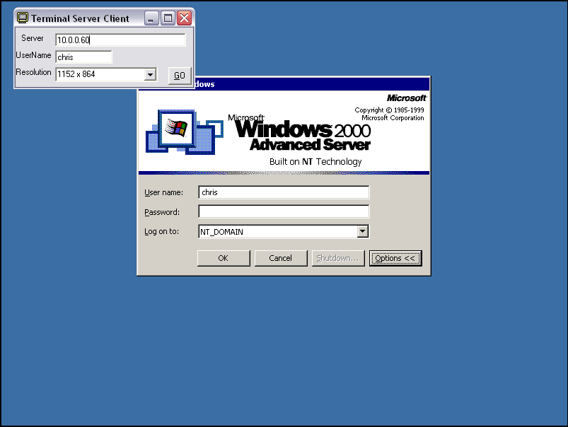



## Terminal Services Client

### Description

Connects to a remote Windows 2000/XP Terminal Server which runs on port 3389.
 
### More Info
 
Make shure that you register the OCX included before running the program. Also for a list of terminal servers to connect to try scanning 130.39.100.1 - 130.39.250.254 for port 3389.

Open a terminal window that is what ever size you choose.

             |
---                |---
**Submitted On**   |2001-12-07 10:14:48
**By**             |[Chris Peneguy](https://github.com/Planet-Source-Code/PSCIndex/blob/master/ByAuthor/chris-peneguy.md)
**Level**          |Intermediate
**User Rating**    |5.0 (15 globes from 3 users)
**Compatibility**  |VB 5\.0, VB 6\.0
**Category**       |[Complete Applications](https://github.com/Planet-Source-Code/PSCIndex/blob/master/ByCategory/complete-applications__1-27.md)
**World**          |[Visual Basic](https://github.com/Planet-Source-Code/PSCIndex/blob/master/ByWorld/visual-basic.md)
**Archive File**   |[Terminal\_S400781272001\.zip](https://github.com/Planet-Source-Code/chris-peneguy-terminal-services-client__1-29558/archive/master.zip)

